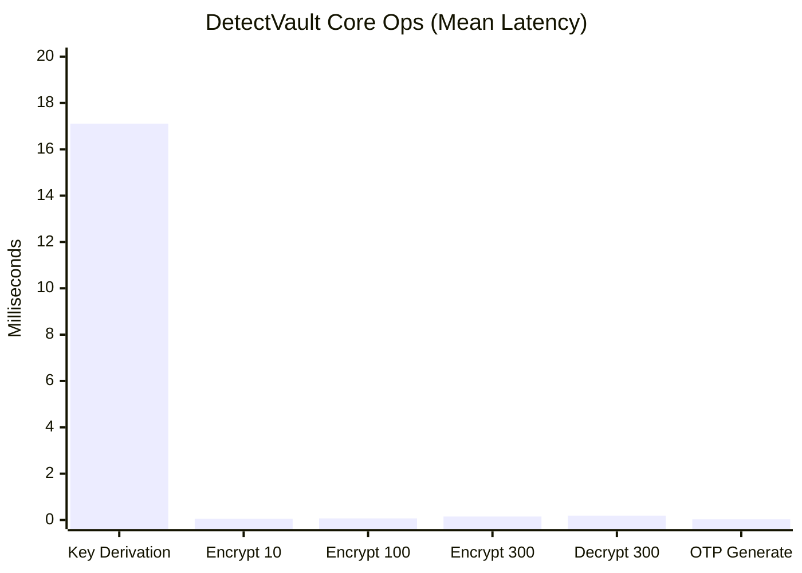
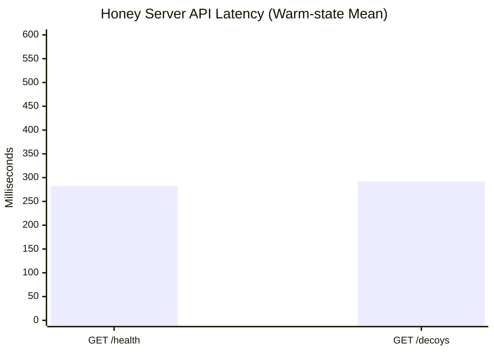
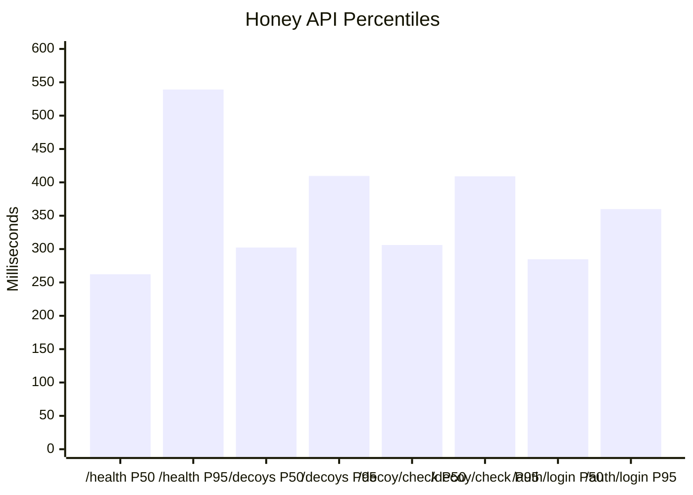
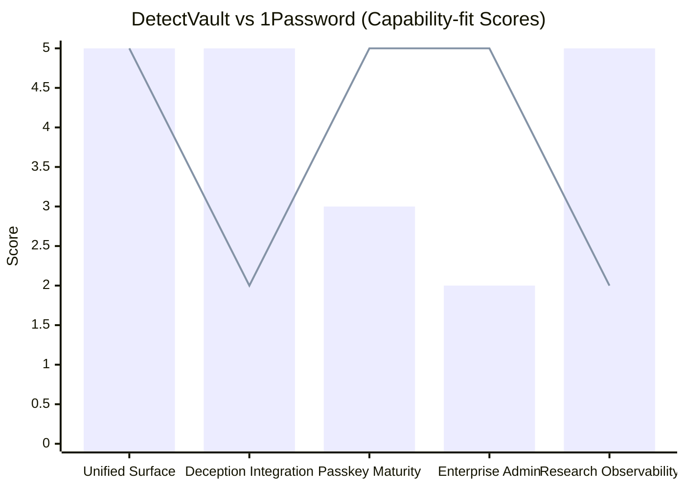
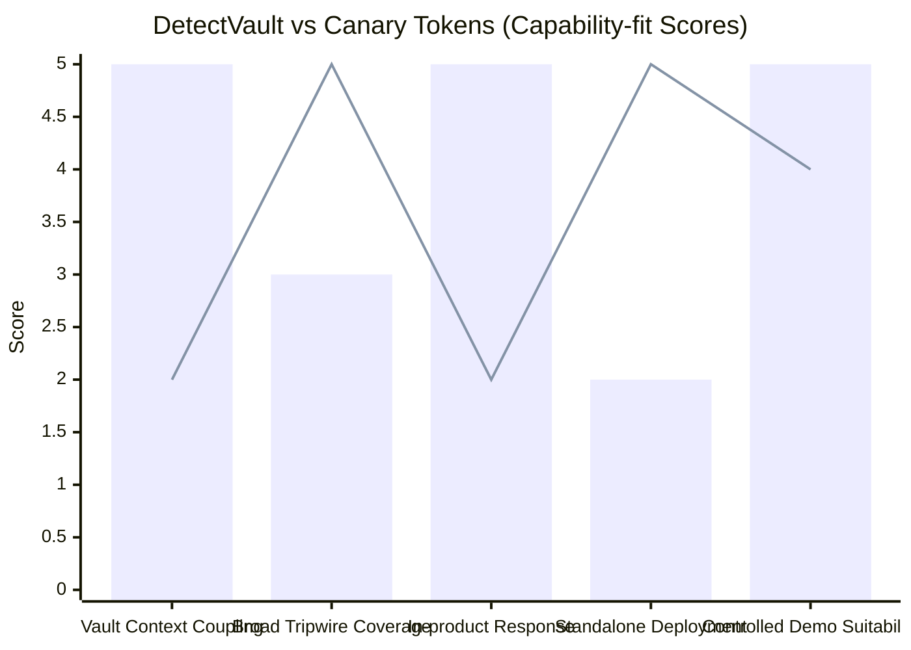

# DetectVault Performance Graphs (Report-ready)

## 1) Core Operations Latency (Mean, ms)



## 2) Honey Server API Latency (Warm-state Mean, ms)



## 3) Honey Server API Distribution (P50 vs P95, ms)



## 4) OTP+Passkey Unification Comparison Scores

(Scale: 1 to 5; capability-fit scoring)



Legend: `bar` = DetectVault, `line` = 1Password

## 5) Breach Detection Comparison Scores

(Scale: 1 to 5; capability-fit scoring)



Legend: `bar` = DetectVault, `line` = Canary Tokens

## 6) Optional CSV for external plotting (Excel/Sheets)

```csv
metric,mean_ms,p50_ms,p95_ms
key_derivation,17.11,16.42,23.81
encrypt_10_entries,0.05,0.02,0.06
encrypt_100_entries,0.07,0.06,0.12
encrypt_300_entries,0.15,0.14,0.24
decrypt_300_entries,0.19,0.18,0.30
otp_generate,0.03,0.02,0.05
health_warm,282.31,262.24,539.18
decoys_warm,291.82,302.35,409.60
decoy_check,307.17,306.11,409.08
auth_login,279.69,284.76,359.91
```
