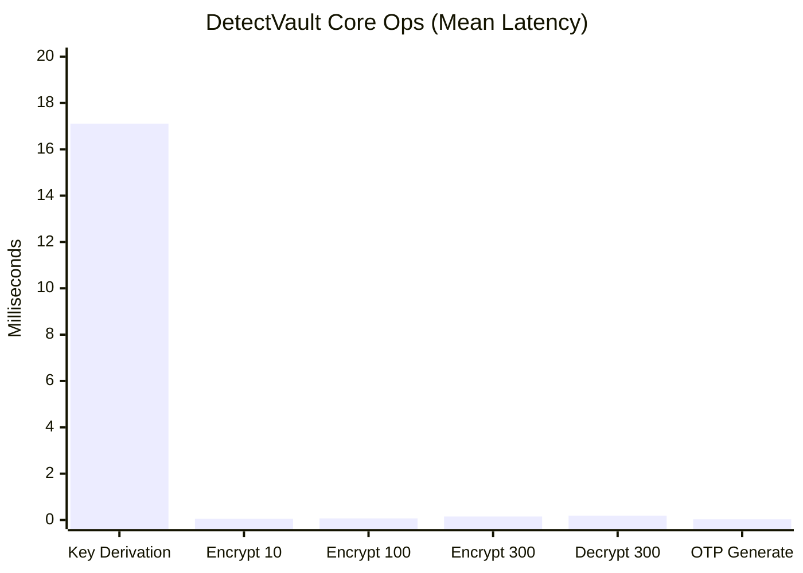
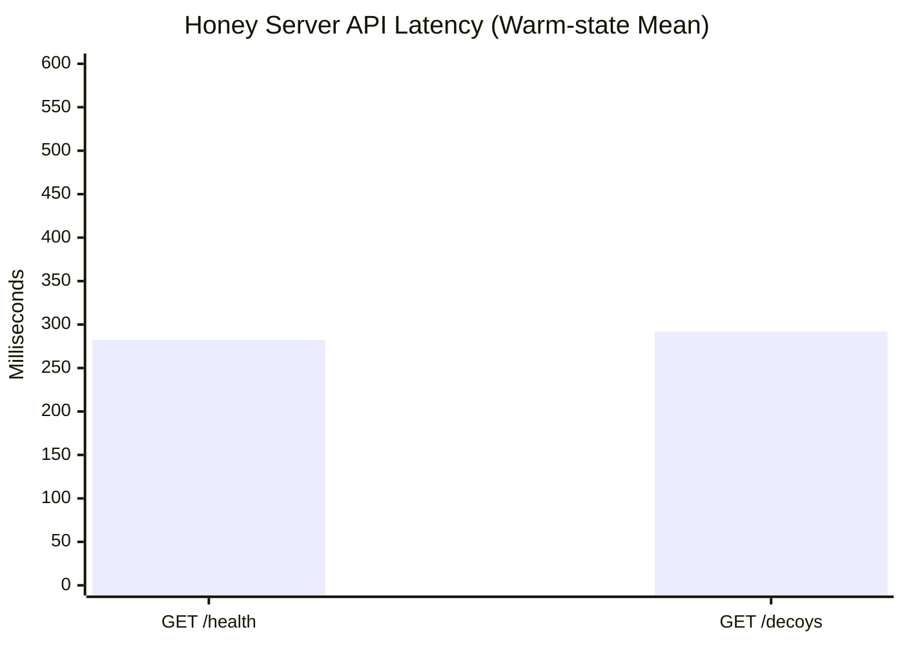
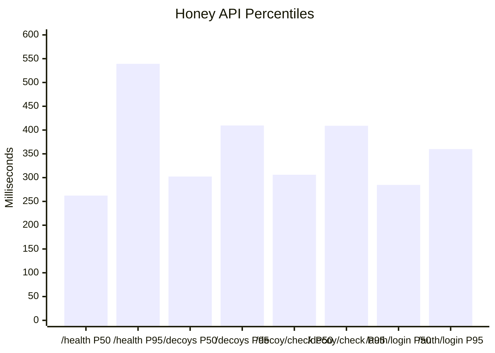
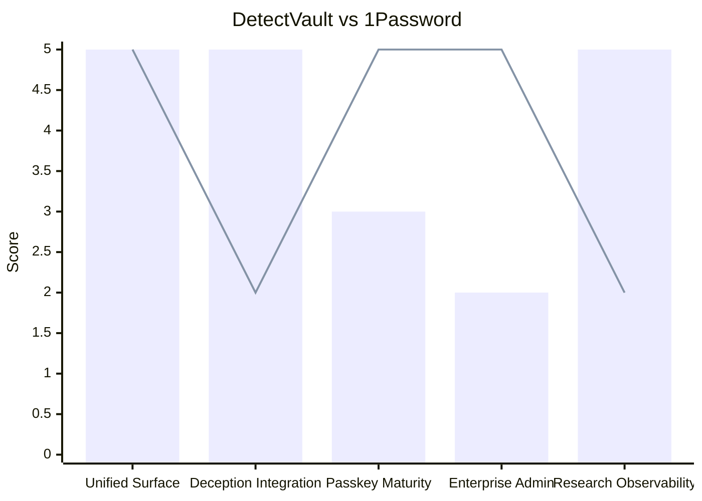
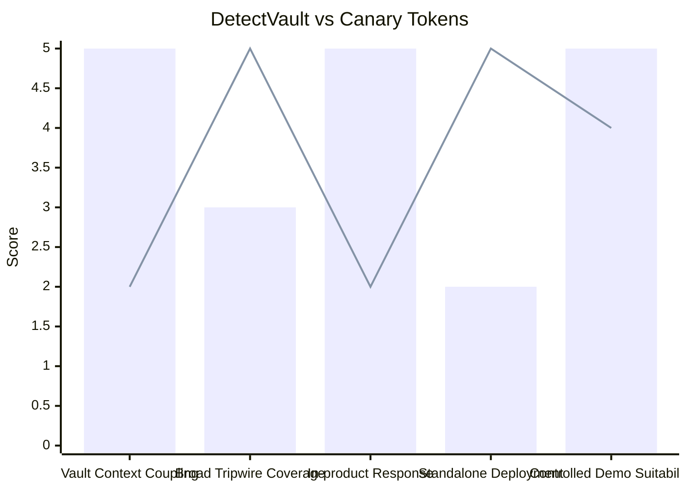

# DetectVault Graphs For Report

## Graph 1: Core Operations Latency (Mean, ms)

## Graph 2: Honey Server API Latency (Warm-state Mean, ms)

## Graph 3: Honey API Percentiles (P50 vs P95)

## Graph 4: OTP + Passkey Unification (DetectVault vs 1Password)

(Score scale: 1 to 5; capability-fit scoring)

Legend: `bar` = DetectVault, `line` = 1Password

## Graph 5: Breach Detection (DetectVault vs Canary Tokens)

(Score scale: 1 to 5; capability-fit scoring)

Legend: `bar` = DetectVault, `line` = Canary Tokens
